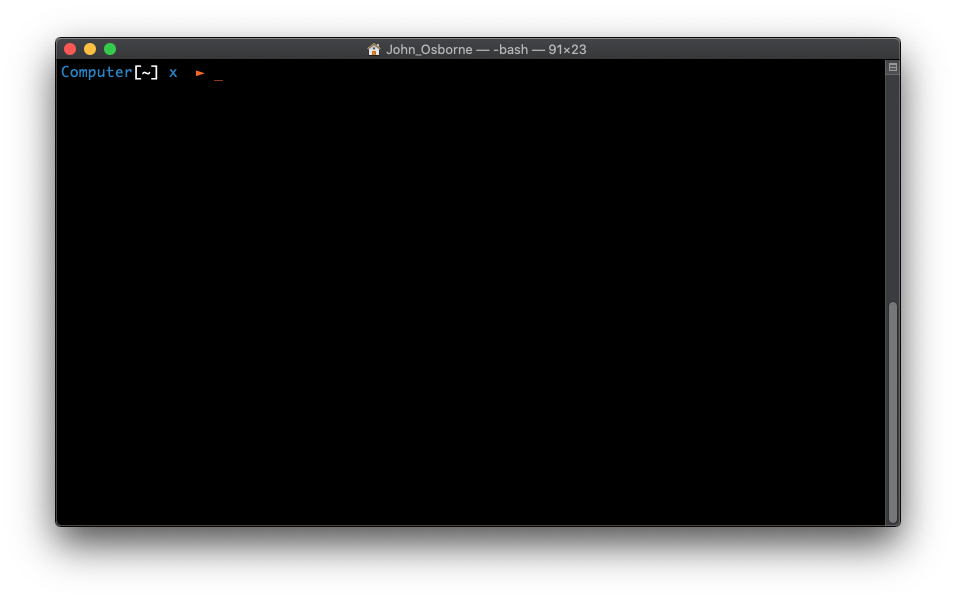
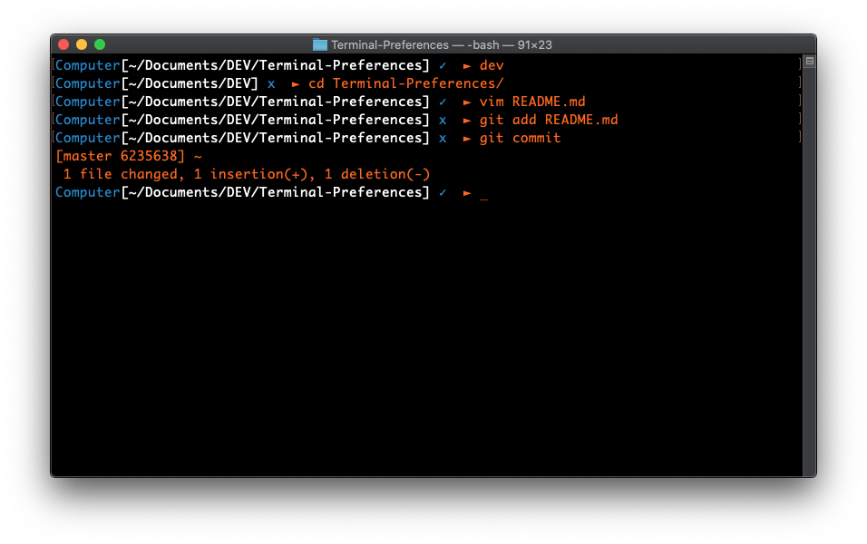

# terminal-prefernces
## A set of customised prefernces and themes for Mac's terminal.

Items include:
 - Default Monaco *(see photos)*
 - Grass
 - Matrix Green
 - Novel
 - Red Preset
 - A **.bash_profile** script for custom prompt

