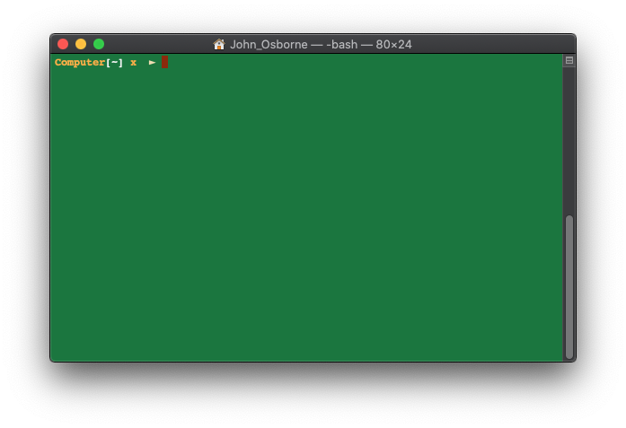
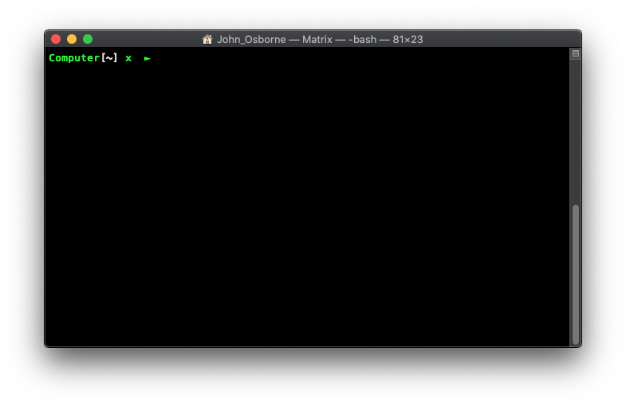
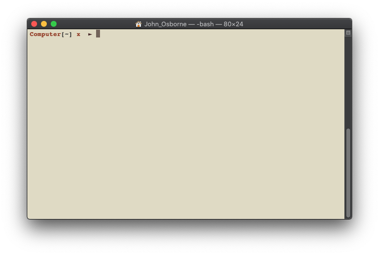
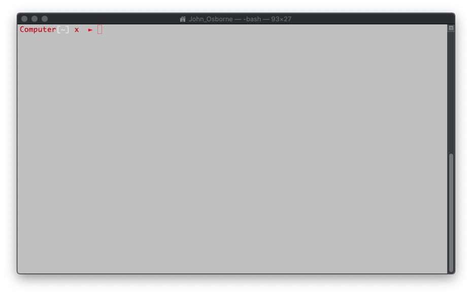

# terminal-prefernces
A set of customised prefernces and themes for Mac's terminal.

Items include:
 - Default Monaco *(see photos)*
 - Grass
 - Matrix Green
 - Novel
 - Red Preset
 - A **.bash_profile** script for custom prompt

1. Defualt Monaco

2. Grass

3. Matrix Green

4. Novel

5. Red Preset *(Transparent not grayscale)*

